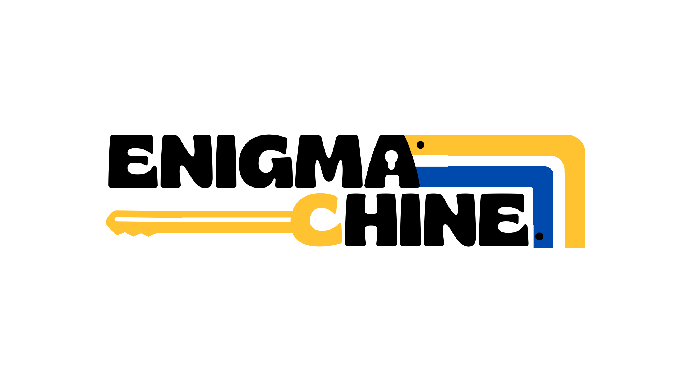

# Enigma


A simple Python-library of the famous enigma machine.

## Instalation

```bash
pip install enigmachine
```

## Usage


```python
enigma_sender = EnigmaMachine(
    rotor_wirings=[
        "BDFHJLCPRTXVZNYEIWGAKMUSQO",
        "AJDKSIRUXBLHWTMCQGZNPYFVOE",
        "EKMFLGDQVZNTOWYHXUSPAIBRCJ",
    ],
    rotor_offsets=[0, 0, 0],
    reflector_wirings='YRUHQSLDPXNGOKMIEBFZCWVJAT'
)
encripted_msg = enigma_sender.encrypt("HELLO")

enigma_receiver = EnigmaMachine(
    rotor_wirings=[
        "BDFHJLCPRTXVZNYEIWGAKMUSQO",
        "AJDKSIRUXBLHWTMCQGZNPYFVOE",
        "EKMFLGDQVZNTOWYHXUSPAIBRCJ",
    ],
    rotor_offsets=[0, 0, 0],
    reflector_wirings='YRUHQSLDPXNGOKMIEBFZCWVJAT')


decripted_msg = enigma_receiver.encrypt(encripted_msg)

assert decripted_msg == "HELLO"

```

## Configuration

The EnigmaMachine class takes the following parameters:
* `rotor_wirings`:  A list of strings, each string represents the wiring of a rotor. The first string is the wiring of the rightmost rotor, the second string is the wiring of the middle rotor, and the third string is the wiring of the leftmost rotor. The wiring is a permutation of the 26 letters of the alphabet.

* `rotor_offsets`: A list of integers, each integer represents the initial position of a rotor. The first integer is the initial position of the rightmost rotor, the second integer is the initial position of the middle rotor, and the third integer is the initial position of the leftmost rotor. The initial position is a number between 0 and 25.

* `reflector_wirings`: A string representing the wiring of the reflector. The wiring is a permutation of the 26 letters of the alphabet.

* `plugboard_wirings`: A dictionary representing the connections of the plugboard. The keys are the letters of the alphabet, and the values are the letters that they are connected to. For example, if the value of the key "A" is "Z", it means that the letter "A" is connected to the letter "Z".

* `rotor_names`: A list of strings, each string represents the name of a rotor. The first string is the name of the rightmost rotor, the second string is the name of the middle rotor, and the third string is the name of the leftmost rotor. The name of a rotor is a string of 26 letters, each letter represents the position of the rotor when the letter "A" is at the top position.

* `reflector_name`: Name of the reflector.

## Predefined Machines

The library comes with a set of predefined machines that you can use. The machines can be seen [here](https://github.com/Fer14/enigmachine/blob/main/enigma/configurations.py)

```python
enigma = EnigmaMachine.from_configuration(
    rotor_config=ROTOR_CONFIGURATIONS['Commercial Enigma A, B'],
    rotor_offsets = [0,0,0],
    reflector_config=REFLECTOR_CONFIGURATIONS['A'],
    plugboard_wirings = {}
)
```


## Custom Machine

Alternatively, you can build you own custom machine with your own set of components, by using the `Rotor`, `Reflector`, and `Plugboard` classes. The following components are available:


```python

custom_machine = Machine(
    [
    PlugBoard(wiring={"A":"B"}),
    Rotor(wiring="EKMFLGDQVZNTOWYHXUSPAIBRCJ",offset=0),
    Reflector(wiring="YRUHQSLDPXNGOKMIEBFZCWVJAT")
    ]
)
```

You can watch an example of usage in the following [notebook](https://github.com/Fer14/enigmachine/blob/main/examples.ipynb)


## Contributing

If you would like to contribute to this project, please follow these steps:

- Fork the repository on GitHub.
- Clone the forked repository to your local machine.
- Create a new branch for your feature or bug fix.
- Implement your changes and test them.
- Commit your changes with descriptive commit messages.
- Push the changes to your fork on GitHub.
- Create a pull request to the original repository.


## References

The references that help me build this library are:
- https://www.youtube.com/watch?v=ybkkiGtJmkM&t=245s
- https://www.codesandciphers.org.uk/enigma/example1.htm
- https://www.youtube.com/watch?v=Kz6IlDCyOUY


