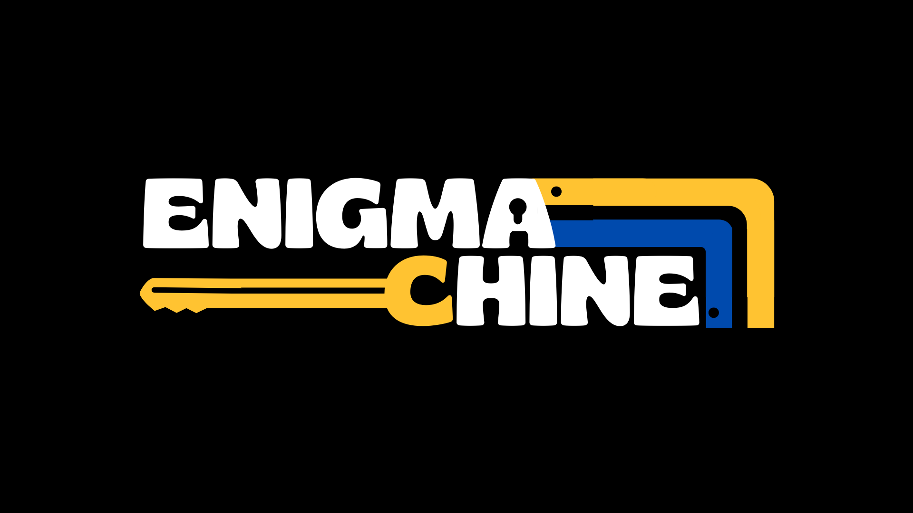

# Enigma




A simple Python-library of the famous enigma machine.

## Requirements

To run this code, you need:

    Python 3.x

## Usage


```python
enigma = EnigmaMachine(
    rotor_positions=[1, 5, 20],
    plugboard_connections={"A": "B", "C": "D",},
    reflector_connections={a: b for a, b in zip(LETTERS, reversed(LETTERS))},
)
message = "HELLO WORLD"
encrypted = enigma.encrypt(message)
```

## Configuration

The EnigmaMachine class takes the following parameters:
* `rotor_positions`: A list of integers representing the positions of each rotor. The first element is the position of the rightmost rotor, the second element is the position of the middle rotor, and the third element is the position of the leftmost rotor.
* `plugboard_connections`: A dictionary representing the connections of the plugboard. The keys are the letters that are connected, and the values are the letters they are connected to.
* `reflector_connections`: A dictionary representing the connections of the reflector. The keys are the letters that are connected, and the values are the letters they are connected to.

## Custom Machine

Alternatively, you can build you own custom machine with your own set of components, by using the `Rotor`, `Reflector`, and `Plugboard` classes. The following components are available:

* `Rotor`: A class representing a rotor. It takes the following parameters:
    * `position`: An integer representing the initial position of the rotor.
    * `letter_ordering`: A string representing the order of the letters on the rotor. The standard is `"ABCDEFGHIJKLMNOPQRSTUVWXY"`

* `RotorMechanism`: A class representing the mechanism of the rotos. It takes the following parameters:
    * `rotors` A list of `Rotor` objects representing the rotors in the machine.
    * `inversed` : Boolean indicating if the mechanism is inverted (i.e., right to left).`

* `Reflector`: A class representing a reflector. It takes the following parameters:
    * `connection`: A dictionary mapping each letter to its corresponding value after passing through the reflect

* `Plugboard`: A class representing a plugboard. It takes the following parameters:
    * `connections`: A dictionary representing the connections of the plugboard. The keys are the letters that are connected, and the values are the letters they are connected to.

```python
rotors = [Rotor(position=position) for position in [1, 5, 20]]
reflector = Reflector({a: b for a, b in zip(LETTERS, reversed(LETTERS))})
rotor_mechanism = RotorMechanism(rotors=rotors)
rotor_mechanism_inverted = RotorMechanism(
    rotors=rotors,
    inversed=True,
)
plug = PlugBoard(
    connections={"A": "Z", "C": "H",}
)
m = Machine(
   [plug,rotor_mechanism,reflector,rotor_mechanism_inverted,plug]
)
message = "HELLO WORLD"
encrypted = m.encrypt(message)
```

You can watch an example of usage in the following [notebook](example.ipynb)


## Contributing

If you would like to contribute to this project, please follow these steps:

- Fork the repository on GitHub.
- Clone the forked repository to your local machine.
- Create a new branch for your feature or bug fix.
- Implement your changes and test them.
- Commit your changes with descriptive commit messages.
- Push the changes to your fork on GitHub.
- Create a pull request to the original repository.


